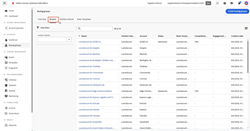
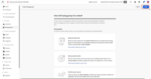
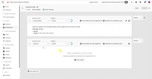

# [!DNL Journey Optimizer B2B Edition] 教學課程

了解如何充分利用 [!DNL Journey Optimizer B2B Edition]。使用內建的生成式 AI 和業界領先的自動化功能，協調帳戶與購買群組歷程，最大限度地提高對特定方案的需求。

## 新增功能 {#whats-new}

* [購買群組階段](/help/buying-groups/buying-group-stages.md)
  _瞭解如何在單一階段模型中建立多個購買群組生命週期階段，並指定轉換規則。_

* [接聽AEP活動](/help/account-journeys/journey-nodes/listen-for-aep-events.md)
  _在您的帳戶歷程中定義並使用任何體驗事件。_

* [付費媒體協調流程](/help/account-journeys/journey-nodes/paid-media-orchestration.md)
  _瞭解如何使用歷程將人員移至外部受眾，然後可以推送至AEP目的地目錄中的任何支援付費媒體目的地。_

## 最受歡迎影片 {#most-popular-videos}

<table>
<tr>
<td>

<a href="/help/buying-groups/buying-groups-overview.md"><strong>購買群組總覽</strong></a>

</td>
<td>

<a href="/help/buying-groups/create-a-buying-group.md"><strong>建立購買群組</strong></a>

</td>
<td>

<a href="/help/buying-groups/role-templates.md"><strong>角色範本</strong></a>

</td>
</tr>
</table>
